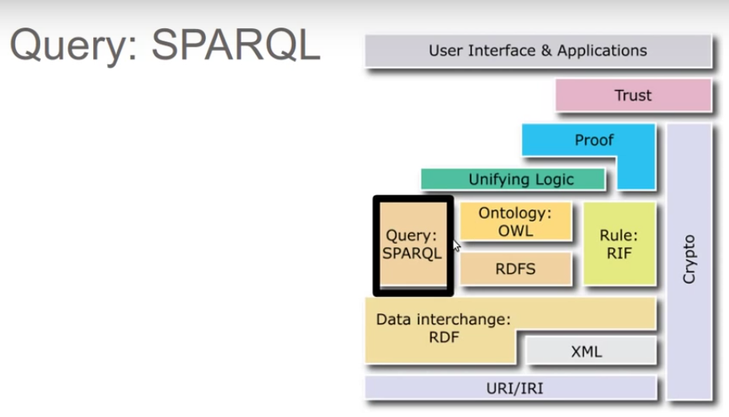
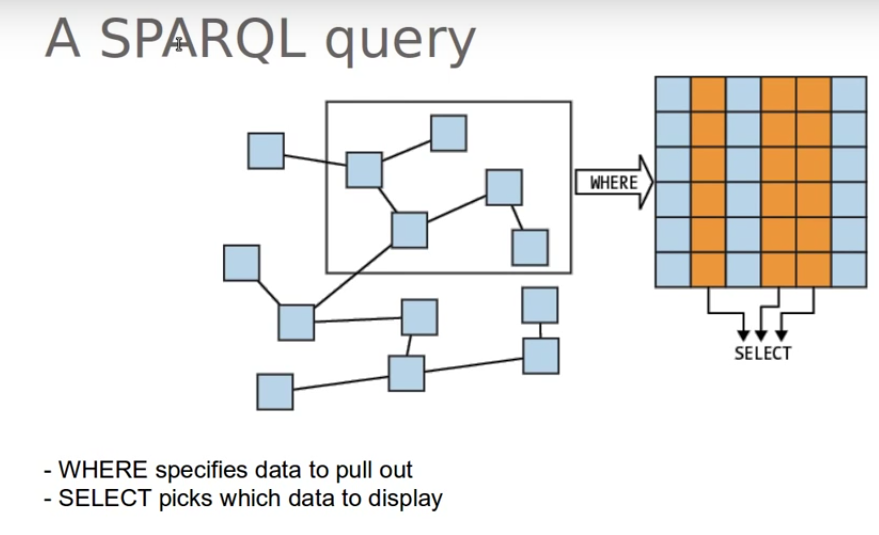
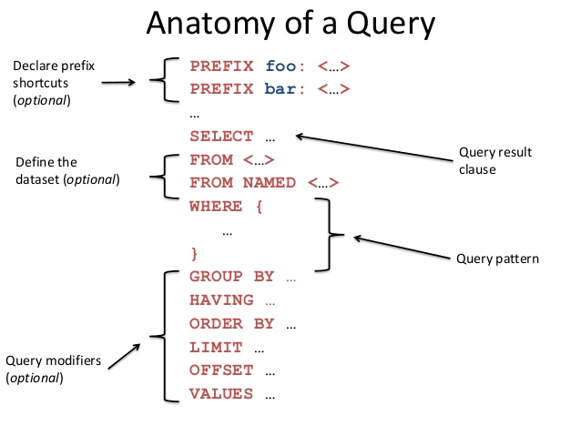

# SPARQL

SPARQL (pronounced "sparkle", a recursive acronym for SPARQL Protocol and RDF Query Language) is an RDF query language, that is, a semantic query language for databases, able to retrieve and manipulate data stored in Resource Description Framework (RDF) format. It was made a standard by the RDF Data Access Working Group (DAWG) of the World Wide Web Consortium, and is recognized as one of the key technologies of the semantic web. On 15 January 2008, SPARQL 1.0 became an official W3C Recommendation, and SPARQL 1.1 in March, 2013.



SPARQL allows for a query to consist of triple patterns, conjunctions, disjunctions, and optional patterns.

## A SPARQL query



## Anatomy of a query



SPARQL has four query forms. These query forms use the solutions from pattern matching to form result sets or RDF graphs. The query forms are:

* **SELECT**
    * Returns all, or a subset of, the variables bound in a query pattern match.
* **CONSTRUCT**
    * Returns an RDF graph constructed by substituting variables in a set of triple templates.
* **ASK**
    * Returns a boolean indicating whether a query pattern matches or not.
* **DESCRIBE**
    * Returns an RDF graph that describes the resources found.

**Example**

<div class="tabbable"> <!-- Only required for left/right tabs -->
<ul class="nav nav-tabs">
<li class="active"><a href="#ex1tab1" data-toggle="tab">Query</a></li>
<li><a href="#ex1tab2" data-toggle="tab">Result</a></li>
<li><a href="#ex1tab3" data-toggle="tab">Data</a></li>
</ul>

<div class="tab-content">

<div class="tab-pane active" id="ex1tab1">
<pre>
# filename: ex008.rq
&nbsp;
PREFIX ab: &lt;http://learningsparql.com/ns/addressbook#&gt;
&nbsp;
SELECT ?person
WHERE
{ ?person ab:homeTel &quot;(229) 276-5135&quot;}
</pre>
</div> <!-- end tab 1 -->

<div class="tab-pane" id="ex1tab2">
<pre>
person
http://learningsparql.com/ns/addressbook#richard
</pre>
</div> <!-- end tab 2 -->

<div class="tab-pane" id="ex1tab3">
<pre>
# filename: ex012.ttl
&nbsp;
@prefix ab: &lt;http://learningsparql.com/ns/addressbook#&gt; .
@prefix d:  &lt;http://learningsparql.com/ns/data#&gt; .
&nbsp;
d:i0432 ab:firstName &quot;Richard&quot; .
d:i0432 ab:lastName  &quot;Mutt&quot; .
d:i0432 ab:homeTel   &quot;(229) 276-5135&quot; .
d:i0432 ab:email     &quot;richard49@hotmail.com&quot; .
&nbsp;
d:i9771 ab:firstName &quot;Cindy&quot; .
d:i9771 ab:lastName  &quot;Marshall&quot; .
d:i9771 ab:homeTel   &quot;(245) 646-5488&quot; .
d:i9771 ab:email     &quot;cindym@gmail.com&quot; .
&nbsp;
d:i8301 ab:firstName &quot;Craig&quot; .
d:i8301 ab:lastName  &quot;Ellis&quot; .
d:i8301 ab:email     &quot;craigellis@yahoo.com&quot; .
d:i8301 ab:email     &quot;c.ellis@usairwaysgroup.com&quot; .
</pre>
</div> <!-- end tab 3 -->

</div>
</div>

## Offline query example

```
# GET CRAIG EMAILS
PREFIX rdf: <http://www.w3.org/1999/02/22-rdf-syntax-ns#>
PREFIX owl: <http://www.w3.org/2002/07/owl#>
PREFIX xsd: <http://www.w3.org/2001/XMLSchema#>
PREFIX rdfs: <http://www.w3.org/2000/01/rdf-schema#>
PREFIX : <http://www.semanticweb.org/lananh/ontologies/2016/10/untitled-ontology-3#>

SELECT ?craigEmail
WHERE
{ :craig :email ?craigEmail . }
```

## Online query example

```
PREFIX ab: <http://learningsparql.com/ns/addressbook#>

SELECT ?craigEmail
WHERE
{ ab:craig ab:email ?craigEmail . }
```

## Query in dbpedia.org

[Example](http://dbpedia.org/snorql/?query=SELECT+*+WHERE+%7B%0D%0A+%3Fa+%3Fb+%3Fc+.%0D%0A%7D+LIMIT+20)

```
SELECT * WHERE {
 ?a ?b ?c .
} LIMIT 20
```
